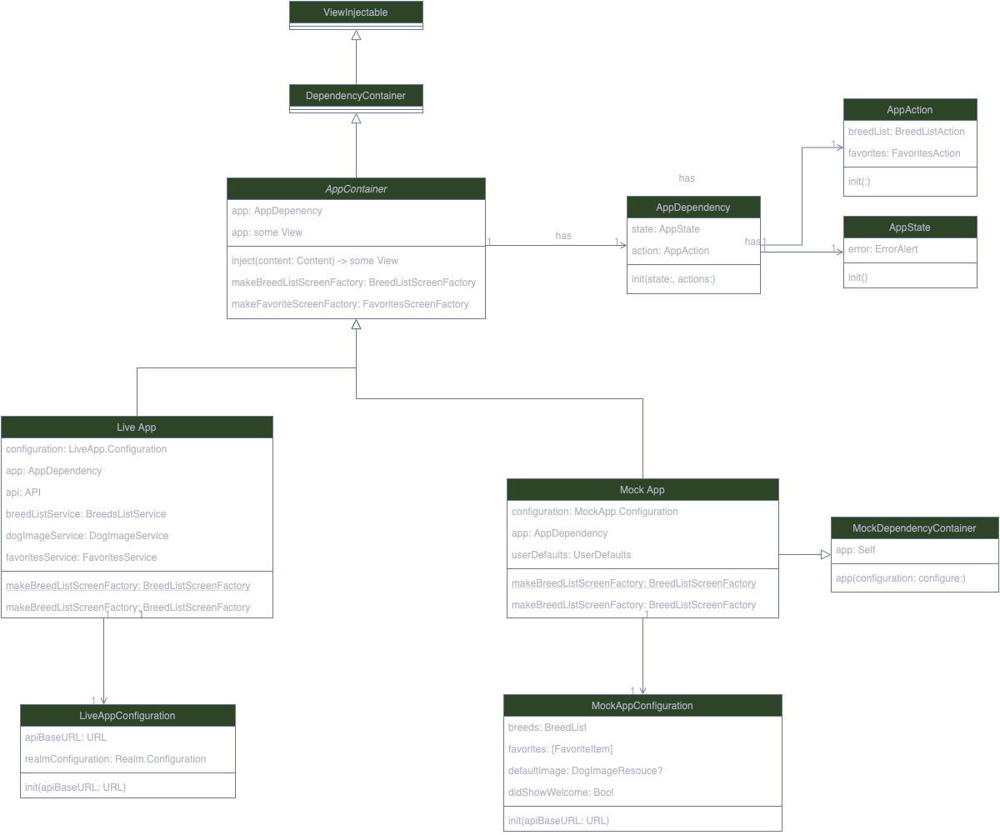

# Introduction
I have developed multiple SwiftUI apps, ranging from small to large, available on the App Store.
In all of them, I use MVVM-C, a pattern I have relied on to develop UIKit apps for most of my career. 
I can't complain; it works well with UIKit apps, whether using Combine or RxSwift.

However, I always felt something was missing, something unnatural. 
It seemed like I was bending SwiftUI to fit MVVM, which was often inconvenient.

Then I read [Stop Using MVVM for SwiftUI](https://forums.developer.apple.com/forums/thread/699003), and that’s when I discovered the [SwiftUI First pattern](https://apurin.me/articles/swiftui-first/). 
This project demonstrates the power of this pattern and marks my transition away from MVVM for SwiftUI.


### App Container
Everything revolves around the `App Container` where all the dependencies are initialized, including:

1. **Infrastructure Layer**: Such as the Realm framework and API layer.
2. **Services**: Built on top of the Infrastructure layer, including `BreedListService` and `FavoritesService`.
3. **UI Layer**: ScreenFlows responsible for ScreenData and Screen Navigation.
4. **Domain**: Core entities such as Breed or SubBreed and other helpers.

Another interesting point of this pattern is the use of the SwiftUI Environment to pass around global services like `BreedListService` as `AppActions` and `AppStates`, allowing any view to access them in a way that respects the nature of SwiftUI.

Finally, the Live App Container uses real data for the application, while the Mock App Container is configured for use in previews.



## Installation

To get started with the DogBreed App, follow these steps:

1. **Clone the repository**:
   ```sh
   git clone https://github.com/anthony1810/SwiftUI_MVPattern_Template.git
2. **Navigate to the project directory**:
   ```cd SwiftUI_MVPattern_Template```
3. **Open the project in Xcode**:
   ```open Vocap.xcodeproj```
4. **Install dependencies**:
   ```swift package resolve```
5. **Build and run the app**:
Select your target device or simulator and click the "Run" button in Xcode.

## Contributing

Contributions are welcome! If you'd like to contribute, please follow these steps:

1. Fork the repository.
2. Create a new branch:
```git checkout -b feature/your-feature-name```
3. Commit your changes:
```git commit -m 'Add some feature'```
4. Push to the branch:
```git push origin feature/your-feature-name```
5. Create a Pull Request.

## License
This project is licensed under the MIT License. See the LICENSE file for more details.

## Acknowledgements

Thanks to [Apurin.me](https://apurin.me) for the insightful article on the SwiftUI First design pattern.

## Contact
For any inquiries or feedback, feel free to reach out to [qquang269@gmail.com].

Happy coding!
