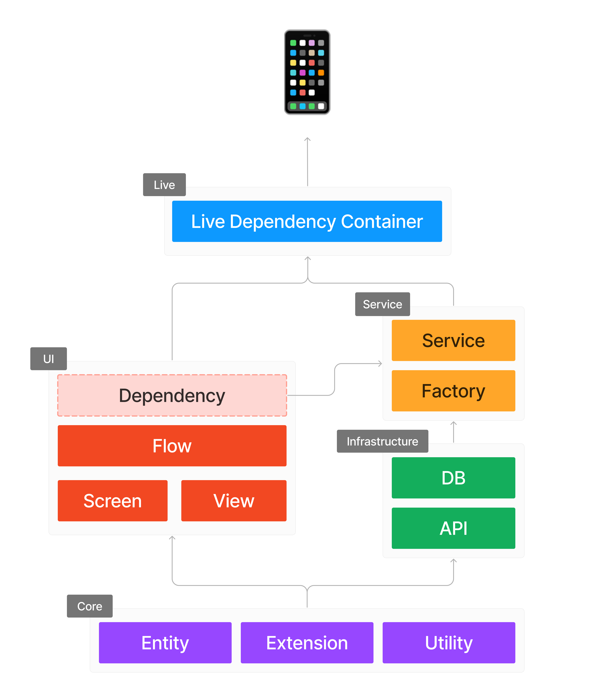
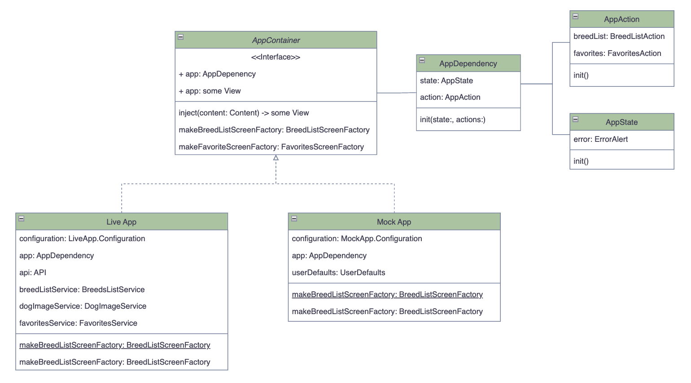
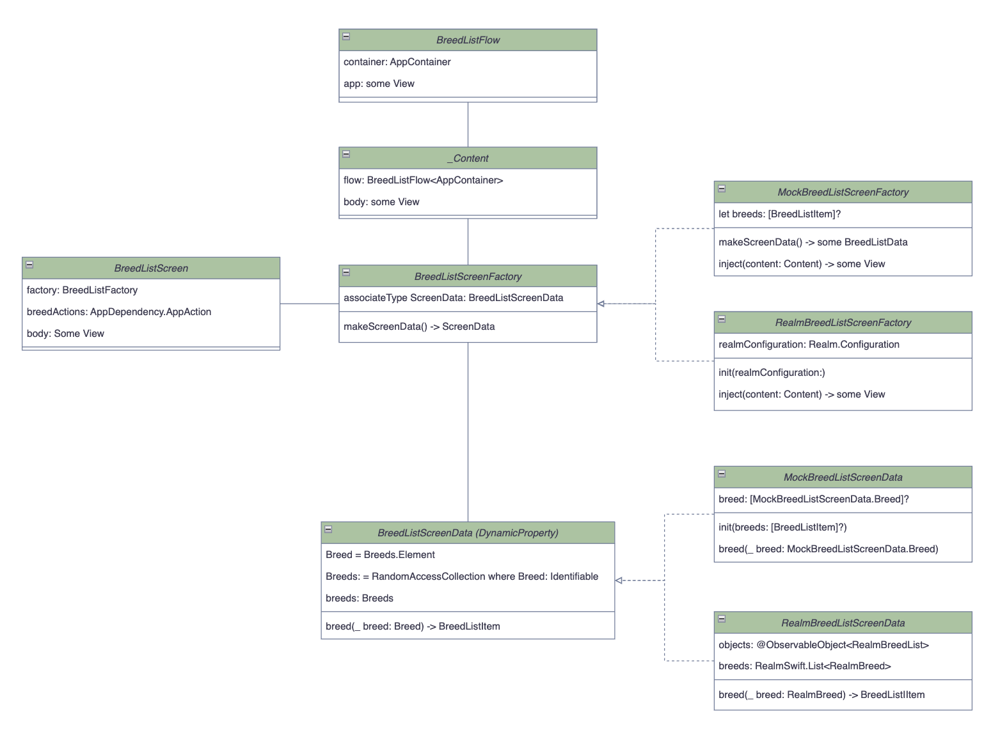

# Introduction
I have developed multiple SwiftUI apps, ranging from small to large, available on the App Store.
In all of them, I use MVVM-C, a pattern I have relied on to develop UIKit apps for most of my career. 
I can't complain; it works well with UIKit apps, whether using Combine or RxSwift.
I am a fan of SOLID and Clean architect.

However, I always felt something was missing, something unnatural. 
It seemed like I was bending SwiftUI to fit MVVM, which was often inconvenient.

Then I read [Stop Using MVVM for SwiftUI](https://forums.developer.apple.com/forums/thread/699003), and that’s when I discovered the [SwiftUI First pattern](https://apurin.me/articles/swiftui-first/). 
This project demonstrates the power of this pattern and marks my transition away from MVVM for SwiftUI.

I prepared a Slide here if you need more reasons to move away from MVVM: https://www.canva.com/design/DAGN0dIE6X8/yNebkOt0Et40xE9EdcydjA/view

There is a on-going discussion about that topic, feel free if you want to join here: https://www.linkedin.com/posts/quang-tran-7780a962_i-just-finished-a-session-with-my-team-where-activity-7236295744528211969-4u3f


1. **Domain/ Core**:  
   - Core entities such as Breed or SubBreed, Utilities, and other helpers that represent core business logic of the app  
   - Will be used directly by the UI Layer & the Infrastructure Layer to guarantee fast build time  
   - Data from different layers must transform into these entities to be used by the UI Layer
   
2. **Infrastructure Layer**:  
   - Alamofire, Realm, MixPanel, and other third-party frameworks can stay here  
   - Provide tools to form the service layer  
   - Infrastructure should use Core Entities to prevent boilerplate of converting back and forth and provide faster build time  

3. **Services**: Built on top of the Infrastructure layer  
   - Provide services from the Infrastructure layer  
   - Will be assigned as UseCases to AppActions and shared across all app modules  
   - Drive AppStates to be shared across all app modules  

4. **UI Layer**:  
   - ScreenFlow: Manages Navigation and manages AppContainer Dependency to be used inside the Screen  
   - ScreenFactory: Prepares necessary data from ScreenData to be used for the Screen  
   - ScreenData: Abstract data needed to be presented on the Screen  
   - Screens: Holds a reference to ScreenFactory as the source of truth for data to be shown, accesses shared state from AppStates, and uses services from AppActions  
   

For larger apps, This Architect support Modularity, follow this guideline to break your apps into smaller, logical components. 
This is recommended approach to adhering to SOLID principles.
```
let package = Package(
  name: "Package",
  products: [
    .library(name: "Core", targets: ["Core"]),
    .library(name: "AppUI", targets: ["AppUI"]),
    .library(name: "APIClient", targets: ["APIClient"]),
    .library(name: "AppServices", targets: ["AppServices"]),
    .library(name: "LiveApp", targets: ["LiveApp"]),
  ],
  targets: [
    // MARK: Core
    
    .target(name: "Core"),
    
    // MARK: UI
    
    .target(name: "AppUI", dependencies: ["Core"]),
    
    // MARK: Infrastructure
    
    .target(name: "APIClient", dependencies: ["Core"]),
    
    // MARK: Service
    
    .target(name: "AppServices", dependencies: ["Core", "APIClient", "AppUI"]),
    
    // MARK: Live
    
    .target(name: "LiveApp", dependencies: ["Core", "AppUI", "APIClient", "AppServices"]),
  ]
)
```

## Why SwiftUI First?

### Challenges with MVVM

- **Redundancy of ViewModel**: In SwiftUI, the View binds directly to the state, making a separate ViewModel layer somewhat redundant.
- **Logic Separation**: Most logic resides deeper within the Model layer (UseCases, Repositories, Services), reducing ViewModels to merely forwarding calls and connecting publishers to properties.
- **Data Preparation and Transformation**: SwiftUI handles data preparation and transformation within the View itself using features like FormatStyle and localized strings.
- **Dependency Handling**: Managing environment-dependent data in ViewModels is cumbersome, requiring dependency injection during or after initialization and updates.
- **View State Management**: Under strict MVVM, handling states like focus or fetching Core Data objects in ViewModel is challenging.
- **Performance Issues**: Modeling all state with @Published properties in a single ObservableObject reduces granularity in view updates, causing performance inefficiencies.
- **Restrictive Nature**: MVVM feels restrictive, forcing SwiftUI to conform to architectural dogmas rather than leveraging SwiftUI’s strengths.

### Benefits of SwiftUI First

A SwiftUI-first architecture fully embraces and utilizes the tools provided by SwiftUI:

- **State Management**: SwiftUI offers robust state management through property wrappers like @State, @StateObject, and @ObservedObject, and integrates seamlessly with UserDefaults, CoreData, and SwiftData using @AppStorage, @FetchedRequest, and @Query.
- **Dependency Resolution**: The Environment mechanism allows clean and organized dependency injection into views, preferred over custom dependency injection solutions or global objects.
- **Previews**: Previews act as a form of unit testing for UI code, enabling quick verification of views' appearance and behavior under different conditions. An architecture supporting easy implementation and maintenance of previews fosters faster and more reliable development.
- **Clarity**: SwiftUI’s declarative style keeps UI and behavior closely linked, making the app's workings straightforward by examining its views.
- **Flexibility**: SwiftUI’s evolution includes new features and capabilities, such as the App lifecycle, Widgets, App Intents, Concurrency, and Observability. An adaptable architecture allows easy incorporation of these new features.

### App Container
Everything revolves around the `App Container` 
- An interface to create LiveApp with real dependencies or MockApp with mock data and dependencies
- Hold AppDependency including AppStates and AppActions. AppStates hold shared states of the app. AppActions hold App's'UseCases.
- Hold App View - A Root View where the UI Layer Started
- Initilize all components (Infrastructure, Services, AppDependency) base on a specific Configuration(API endpoints, 3rd party Authentication Keys, ...)

Another interesting point of this pattern is the use of the SwiftUI Environment to pass around global services like `BreedListService` as `AppActions` and `AppStates`, allowing any view to access them in a way that respects the nature of SwiftUI.

Finally, the Live App Container uses real data for the application, while the Mock App Container is configured for use in previews.



### UI Layer
A typical UI flow includes the following components

#### 1. Screen Flow:
Definition: The main component that manages navigation and dependency injection for a specific feature or section of the app.
Example: FavoritesFlow<Container: AppContainer>: View
Function:
- Initializes and manages the navigation stack.
- Injects dependencies into the screen.
- Ensures smooth transitions and data flow between different views and screens.

#### 2. Screen Factory:
Definition: A protocol and its implementations that provide the necessary data and dependencies for a screen.
Example: protocol FavoritesScreenFactory: ViewInjectable
Function:
- Defines methods for creating screen data and injecting dependencies.
- Can have multiple implementations for different data sources (e.g., mock data, live data).
- Facilitates separation of concerns by abstracting data creation and dependency management.
  
#### 3. Screen Data:
   
Definition: A protocol and its implementations that define the data model for a screen.
Example: protocol FavoritesScreenData: DynamicProperty
Function:
- Provides the necessary data for the screen, typically as a collection of items.
- Defines methods to retrieve individual data items.
- Can be implemented using various data sources (e.g., mock data, database).

#### 4. Views: 
Definition: The individual UI components that make up a screen.
Example: FavoritesGridItem: View
Function:
- Represent different parts of the screen, such as lists, grids, buttons, and images.
- Handle user interactions and state changes.
- Are reusable and can be composed to create complex UIs.

#### Importance of Mocks
- Purpose: Provide mock implementations for factories and data sources to facilitate testing and previews.
- Components: MockFavoritesScreenData and MockFavoritesScreenFactory
- Importance:
   + Testing: Allow developers to simulate various states and interactions without relying on live data or backend services.
   + Previews: Enable SwiftUI previews to display the UI with predefined mock data, ensuring that the UI can be developed and tested independently.
   + Robustness: Helps in creating more robust and maintainable code by decoupling UI development from data fetching logic.





## Installation

To get started with the DogBreed App, follow these steps:

1. **Clone the repository**:
   ```sh
   git clone https://github.com/anthony1810/SwiftUI_MVPattern_Template.git
2. **Navigate to the project directory**:
   ```cd SwiftUI_MVPattern_Template```
3. **Open the project in Xcode**:
   ```open Vocap.xcodeproj```
4. **Install dependencies**:
   ```swift package resolve```
5. **Build and run the app**:
Select your target device or simulator and click the "Run" button in Xcode.

## Contributing

Contributions are welcome! If you'd like to contribute, please follow these steps:

1. Fork the repository.
2. Create a new branch:
```git checkout -b feature/your-feature-name```
3. Commit your changes:
```git commit -m 'Add some feature'```
4. Push to the branch:
```git push origin feature/your-feature-name```
5. Create a Pull Request.

## Full Example Projects
- [Breed App](https://github.com/anthony1810/BreedApp_SwiftUI): DogBreed App is a mobile application developed using Swift and SwiftUI that allows users to identify different breeds of dogs. This project implements the SwiftUI First design pattern, an alternative to MVVM.

## License
This project is licensed under the MIT License. See the LICENSE file for more details.

## Acknowledgements

Thanks to [Apurin.me](https://apurin.me) for the insightful article on the SwiftUI First design pattern.

## Contact
For any inquiries or feedback, feel free to reach out to [qquang269@gmail.com].

Happy coding!
